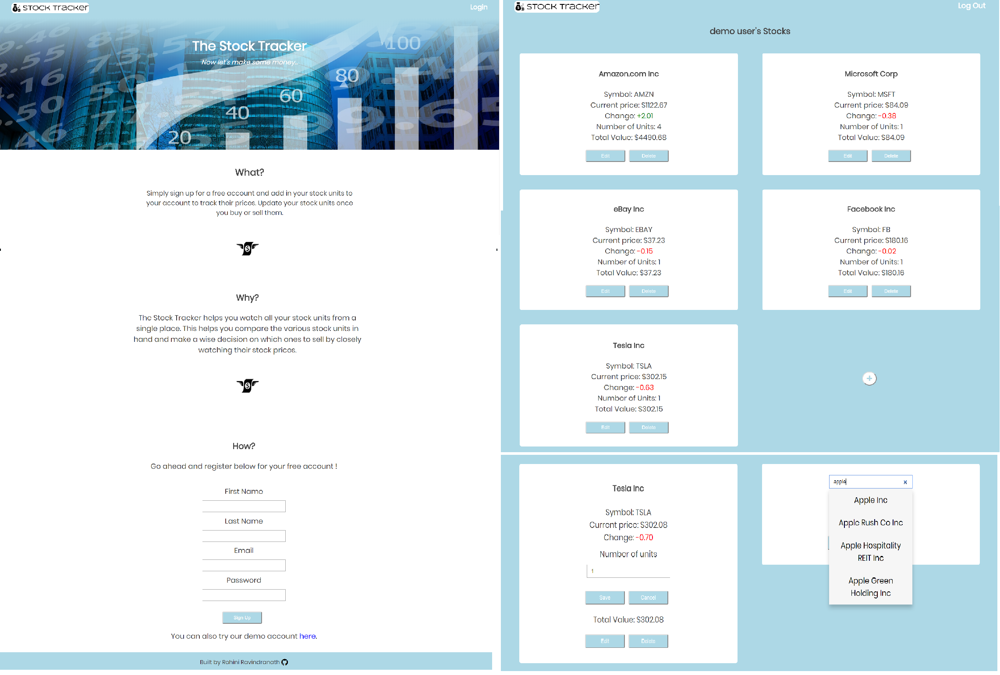

<h1>Stock Tracker</h1>

<a href="https://stock-tracker.netlify.com/">Stock Tracker</a> is an app that allows users to manage and track the stocks they possess.

<h2>Introduction</h2>

The Stock Tracker is intended to help you track all your stocks periodically from a single place and thus make a wise decision of what to sell or buy. It helps you to florish in the ever-changing stock market.

<h2>How it Works</h2>
<h3>Search and add stocks</h3>

Whenever you purchase a stock, use the search provided to look up company that you are interested in, specify the number of units you possess and add them to your account

<h3>Keep track of your stocks</h3>

Every time you login to your account, you can see the current value per unit and the total value of all your stock units and the most recent growth or decline per unit of your stock.

<h3>Add more units</h3>

When you purchase or sell units of a particular stock that you possess, simply use the edit option to edit the number of units. Your account will then reflect the updated stock value.

<h3>Delete stocks</h3>

Once you have sold off all units of a particular stock, use the delete option to remove the company from your account.

<h2>API Used</h2>

The app uses the Stock Tracker API. Documentation for the API can be found <a href="https://github.com/rohinieravi/stock-tracker-api/blob/master/README.md">here</a>

<h2>Technology</h2>
<h3>Front End</h3>
<ul>
  <li>HTML5</li>
  <li>CSS3</li>
  <li>React</li>
  <li>Redux</li>
  <li>Enzyme + Jest (testing)</li>
</ul>
<h3>Back End</h3>
<ul>
  <li>Node.js + Express.js (web server)</li>
  <li>Mongoose, MLAB (database)</li>
  <li><a href="https://mochajs.org/">Mocha</a> + <a href="http://chaijs.com/">Chai</a> (testing)</li>
  <li>Continuous integration and deployment with <a href="https://travis-ci.org/">Travis CI</a></li>
</ul>
<h3>Responsive</h3>
<ul>
  <li>The app is fully responsive and quickly adapts to all mobile, tablet, and desktop viewports.</li>
</ul>
<h3>Security</h3>
<ul>
  <li>User passwords are encrypted using <a href="https://github.com/dcodeIO/bcrypt.js">bcrypt.js</a>.</li>
  <li><a href="http://passportjs.org/">Passport</a> is used to control endpoints from unauthorized users.</li>
</ul>

<h2>Animation</h2>
<ul>
  <li><a href="">React Flip Move</a></li>
</ul>

<h2>Graphic Attributions</h2>
<h4>"Money"</h4>
<ul>
  <li><a href="https://thenounproject.com/vectormarket01/">Yo! Baba</a></li>
  <li>https://thenounproject.com/term/money/1280144/</li>
  <li><a href="https://creativecommons.org/licenses/by/3.0/">https://creativecommons.org/licenses/by/3.0/</a></li>
</ul>
<h4>"Down Finance"</h4>
<ul>
  <li><a href="https://thenounproject.com/iconisland">Icon Island</a></li>
  <li><a href="https://thenounproject.com/term/down-finance/398875/">https://thenounproject.com/term/down-finance/398875/</a></li>
  <li><a href="https://creativecommons.org/licenses/by/3.0/">https://creativecommons.org/licenses/by/3.0/</a></li>
</ul>
<h4>"Flying Money"</h4>
<ul>
  <li><a href="https://thenounproject.com/hansmosl/">Hans Paul Mösl Junior</a></li>
  <li><a href="https://thenounproject.com/term/flying-money/979139/">https://thenounproject.com/term/flying-money/979139/</a></li>
  <li><a href="https://creativecommons.org/licenses/by/3.0/">https://creativecommons.org/licenses/by/3.0/</a></li>
</ul>